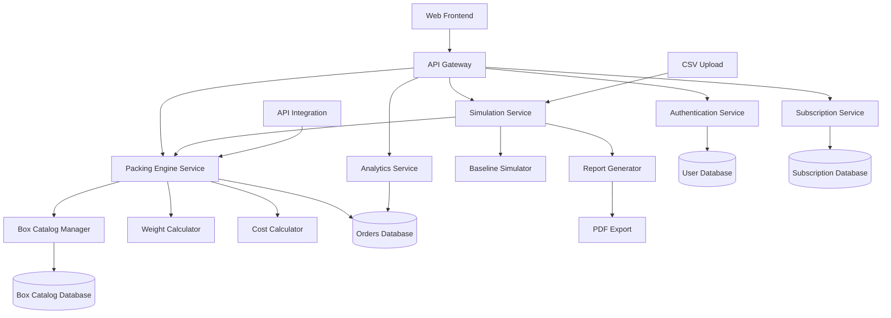
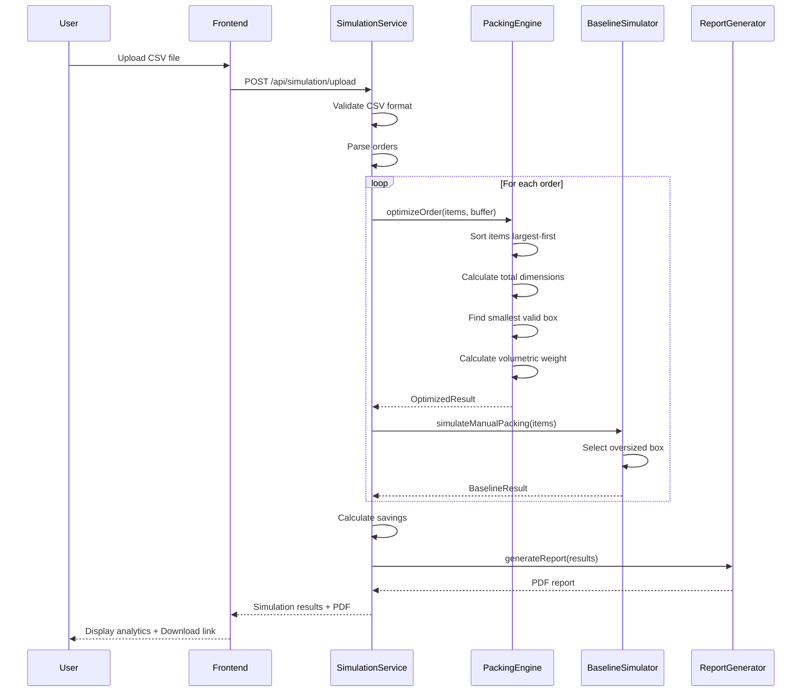
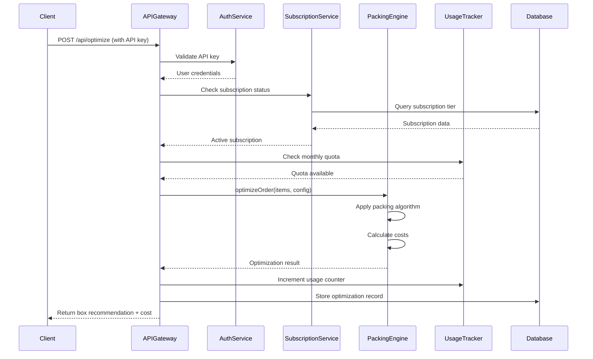

# Design Document: AI Packaging Optimizer

## Overview

The AI Packaging Optimizer is a production-grade B2B SaaS platform designed for logistics cost optimization targeting D2C brands, Shopify sellers, small-to-mid ecommerce warehouses, and 3PL operators handling 100-500+ orders per day. The system accepts real shipment-level CSV data, applies realistic packaging constraints using a predefined box catalog, calculates volumetric and billable weights, and simulates baseline versus optimized packing scenarios to demonstrate realistic savings in the 5-15% range. The platform operates in three modes: free simulation for lead generation, one-time optimization audits, and monthly SaaS subscriptions with API integration for live optimization.

The core value proposition addresses the volumetric weight inefficiency problem where carriers charge based on the greater of actual weight or volumetric weight (calculated as L × W × H / volumetric_divisor). By selecting optimal box sizes from a predefined catalog and applying configurable buffer padding, the system minimizes wasted space and reduces billable shipping costs. The platform includes comprehensive analytics dashboards, ROI reporting, subscription management, and is architected for scalability with future integrations for Shopify, multi-warehouse support, and courier APIs.

## Architecture

The system follows a modern three-tier architecture with clear separation between presentation, business logic, and data layers. The frontend provides a responsive B2B SaaS interface with multiple operational dashboards, while the backend exposes RESTful APIs for all core operations including authentication, packing optimization, simulation, and analytics.




## Main Workflow Sequence Diagrams

### Simulation Mode Workflow



### Live Optimization API Workflow




## Components and Interfaces

### Component 1: Authentication Service

**Purpose**: Manages user authentication, authorization, role-based access control, and API key management for SaaS customers.

**Interface**:
```typescript
interface AuthenticationService {
  register(email: string, password: string, role: UserRole): Promise<User>
  login(email: string, password: string): Promise<AuthToken>
  validateToken(token: string): Promise<User>
  generateAPIKey(userId: string): Promise<APIKey>
  validateAPIKey(apiKey: string): Promise<User>
  refreshToken(refreshToken: string): Promise<AuthToken>
  logout(userId: string): Promise<void>
}

interface User {
  id: string
  email: string
  role: UserRole
  subscriptionTier: SubscriptionTier
  createdAt: Date
  lastLogin: Date
}

enum UserRole {
  ADMIN = "admin",
  CUSTOMER = "customer",
  TRIAL = "trial"
}

enum SubscriptionTier {
  FREE = "free",
  BASIC = "basic",
  PRO = "pro",
  ENTERPRISE = "enterprise"
}

interface AuthToken {
  accessToken: string
  refreshToken: string
  expiresIn: number
}

interface APIKey {
  key: string
  userId: string
  createdAt: Date
  lastUsed: Date
  isActive: boolean
}
```

**Responsibilities**:
- User registration and login with secure password hashing
- JWT token generation and validation
- API key generation for programmatic access
- Role-based access control enforcement
- Session management and token refresh


### Component 2: Box Catalog Manager

**Purpose**: Manages the predefined box catalog including CRUD operations, validation, and box selection queries.

**Interface**:
```typescript
interface BoxCatalogManager {
  addBox(box: BoxDefinition): Promise<Box>
  updateBox(boxId: string, updates: Partial<BoxDefinition>): Promise<Box>
  deleteBox(boxId: string): Promise<void>
  getBox(boxId: string): Promise<Box>
  getAllBoxes(activeOnly: boolean): Promise<Box[]>
  findSuitableBoxes(dimensions: Dimensions, weight: number): Promise<Box[]>
  getBoxUsageStats(dateRange: DateRange): Promise<BoxUsageStats[]>
  toggleBoxStatus(boxId: string, isActive: boolean): Promise<Box>
}

interface BoxDefinition {
  name: string
  length: number
  width: number
  height: number
  maxWeight: number
  isActive: boolean
}

interface Box extends BoxDefinition {
  id: string
  volume: number
  createdAt: Date
  updatedAt: Date
}

interface Dimensions {
  length: number
  width: number
  height: number
}

interface BoxUsageStats {
  boxId: string
  boxName: string
  usageCount: number
  averageUtilization: number
  totalVolume: number
  wastedVolume: number
}

interface DateRange {
  startDate: Date
  endDate: Date
}
```

**Responsibilities**:
- CRUD operations for box catalog
- Validation of box dimensions and weight constraints
- Query suitable boxes based on item requirements
- Track box usage statistics and utilization metrics
- Enable/disable boxes without deletion for historical data integrity


### Component 3: Packing Engine

**Purpose**: Core optimization engine that selects optimal boxes for orders using best-fit algorithm with realistic constraints.

**Interface**:
```typescript
interface PackingEngine {
  optimizeOrder(order: Order, config: PackingConfig): Promise<PackingResult>
  optimizeBatch(orders: Order[], config: PackingConfig): Promise<BatchPackingResult>
  calculateVolumetricWeight(dimensions: Dimensions, divisor: number): number
  calculateBillableWeight(actualWeight: number, volumetricWeight: number): number
  validatePacking(items: Item[], box: Box, buffer: number): boolean
}

interface Order {
  orderId: string
  items: Item[]
  totalWeight: number
}

interface Item {
  itemId: string
  length: number
  width: number
  height: number
  weight: number
  quantity: number
}

interface PackingConfig {
  bufferPadding: number
  volumetricDivisor: number
  shippingRatePerKg: number
  maxWeightOverride?: number
}

interface PackingResult {
  orderId: string
  selectedBox: Box
  totalDimensions: Dimensions
  totalWeight: number
  volumetricWeight: number
  billableWeight: number
  shippingCost: number
  spaceUtilization: number
  wastedVolume: number
  isValid: boolean
  rejectionReason?: string
}

interface BatchPackingResult {
  results: PackingResult[]
  totalOrders: number
  successfulPacks: number
  failedPacks: number
  totalCost: number
  averageUtilization: number
}
```

**Responsibilities**:
- Sort items largest-first for optimal packing
- Calculate total dimensions with buffer padding
- Find smallest valid box from catalog
- Validate dimension and weight constraints
- Calculate volumetric and billable weights
- Compute shipping costs and space utilization
- Reject invalid packings with clear reasons


### Component 4: Simulation Service

**Purpose**: Orchestrates simulation mode for lead generation, comparing optimized packing against baseline manual packing.

**Interface**:
```typescript
interface SimulationService {
  uploadCSV(file: File, userId: string): Promise<SimulationJob>
  processSimulation(jobId: string, config: PackingConfig): Promise<SimulationResult>
  getSimulationStatus(jobId: string): Promise<SimulationStatus>
  generateReport(simulationId: string): Promise<PDFReport>
  getSimulationHistory(userId: string): Promise<SimulationSummary[]>
}

interface SimulationJob {
  jobId: string
  userId: string
  fileName: string
  totalOrders: number
  status: JobStatus
  createdAt: Date
}

enum JobStatus {
  PENDING = "pending",
  PROCESSING = "processing",
  COMPLETED = "completed",
  FAILED = "failed"
}

interface SimulationResult {
  simulationId: string
  jobId: string
  optimizedResults: PackingResult[]
  baselineResults: BaselineResult[]
  comparison: ComparisonMetrics
  savings: SavingsAnalysis
  recommendations: string[]
  anomalyWarnings: string[]
}

interface BaselineResult {
  orderId: string
  selectedBox: Box
  shippingCost: number
  billableWeight: number
}

interface ComparisonMetrics {
  totalOrdersProcessed: number
  optimizedTotalCost: number
  baselineTotalCost: number
  totalSavings: number
  savingsPercentage: number
  averageUtilizationOptimized: number
  averageUtilizationBaseline: number
  volumetricWeightReduction: number
}

interface SavingsAnalysis {
  perOrderSavings: number
  monthlySavings: number
  annualSavings: number
  isRealistic: boolean
  confidenceLevel: number
}

interface SimulationSummary {
  simulationId: string
  createdAt: Date
  totalOrders: number
  savingsPercentage: number
  totalSavings: number
}

interface PDFReport {
  reportId: string
  downloadUrl: string
  expiresAt: Date
}
```

**Responsibilities**:
- Parse and validate CSV uploads
- Orchestrate parallel optimization and baseline simulation
- Calculate realistic savings with anomaly detection
- Generate comprehensive comparison metrics
- Produce PDF reports for business stakeholders
- Flag unrealistic savings (>25%) as data anomalies


### Component 5: Analytics Service

**Purpose**: Provides comprehensive analytics, KPIs, and forecasting for operational dashboards.

**Interface**:
```typescript
interface AnalyticsService {
  getDashboardKPIs(userId: string, dateRange: DateRange): Promise<DashboardKPIs>
  getCostTrend(userId: string, dateRange: DateRange, granularity: TimeGranularity): Promise<CostTrendData>
  getBoxUsageDistribution(userId: string, dateRange: DateRange): Promise<BoxUsageData[]>
  getSpaceWasteHeatmap(userId: string, dateRange: DateRange): Promise<HeatmapData>
  getWeightDistribution(userId: string, dateRange: DateRange): Promise<WeightDistributionData>
  getPackagingInefficiencyIndex(userId: string, dateRange: DateRange): Promise<number>
  forecastPackagingDemand(userId: string, forecastMonths: number): Promise<ForecastData>
}

interface DashboardKPIs {
  totalOrdersProcessed: number
  manualShippingCost: number
  optimizedShippingCost: number
  totalSavings: number
  savingsPercentage: number
  avgVolumetricWeightReduction: number
  avgSpaceUtilization: number
  mostUsedBoxSize: string
  mostInefficientBoxSize: string
  monthlySavingsProjection: number
  annualSavingsProjection: number
}

enum TimeGranularity {
  DAILY = "daily",
  WEEKLY = "weekly",
  MONTHLY = "monthly"
}

interface CostTrendData {
  dataPoints: CostDataPoint[]
  trend: TrendDirection
}

interface CostDataPoint {
  timestamp: Date
  manualCost: number
  optimizedCost: number
  savings: number
}

enum TrendDirection {
  INCREASING = "increasing",
  DECREASING = "decreasing",
  STABLE = "stable"
}

interface BoxUsageData {
  boxId: string
  boxName: string
  usageCount: number
  percentage: number
  averageUtilization: number
}

interface HeatmapData {
  matrix: HeatmapCell[][]
  maxWaste: number
  minWaste: number
}

interface HeatmapCell {
  boxId: string
  dateRange: string
  wastePercentage: number
  orderCount: number
}

interface WeightDistributionData {
  actualWeightBuckets: WeightBucket[]
  volumetricWeightBuckets: WeightBucket[]
  billableWeightBuckets: WeightBucket[]
}

interface WeightBucket {
  rangeStart: number
  rangeEnd: number
  count: number
  percentage: number
}

interface ForecastData {
  forecastPeriods: ForecastPeriod[]
  confidence: number
  methodology: string
}

interface ForecastPeriod {
  month: string
  predictedOrders: number
  predictedCost: number
  predictedSavings: number
}
```

**Responsibilities**:
- Aggregate and compute KPIs for dashboard display
- Generate time-series cost trends with granularity control
- Analyze box usage patterns and inefficiencies
- Calculate packaging inefficiency index
- Provide forecasting for demand planning
- Support date filtering for all analytics queries


### Component 6: Subscription Service

**Purpose**: Manages subscription tiers, usage tracking, quota enforcement, and billing integration.

**Interface**:
```typescript
interface SubscriptionService {
  createSubscription(userId: string, tier: SubscriptionTier): Promise<Subscription>
  updateSubscription(subscriptionId: string, tier: SubscriptionTier): Promise<Subscription>
  cancelSubscription(subscriptionId: string): Promise<void>
  getSubscription(userId: string): Promise<Subscription>
  checkQuota(userId: string): Promise<QuotaStatus>
  incrementUsage(userId: string, orderCount: number): Promise<UsageRecord>
  getUsageHistory(userId: string, dateRange: DateRange): Promise<UsageRecord[]>
  generateInvoice(subscriptionId: string, billingPeriod: BillingPeriod): Promise<Invoice>
}

interface Subscription {
  subscriptionId: string
  userId: string
  tier: SubscriptionTier
  monthlyQuota: number
  currentUsage: number
  status: SubscriptionStatus
  startDate: Date
  renewalDate: Date
  price: number
}

enum SubscriptionStatus {
  ACTIVE = "active",
  SUSPENDED = "suspended",
  CANCELLED = "cancelled",
  TRIAL = "trial"
}

interface QuotaStatus {
  monthlyQuota: number
  currentUsage: number
  remainingQuota: number
  percentageUsed: number
  isExceeded: boolean
}

interface UsageRecord {
  recordId: string
  userId: string
  timestamp: Date
  orderCount: number
  cumulativeUsage: number
}

interface BillingPeriod {
  startDate: Date
  endDate: Date
}

interface Invoice {
  invoiceId: string
  subscriptionId: string
  billingPeriod: BillingPeriod
  totalOrders: number
  basePrice: number
  overageCharges: number
  totalAmount: number
  status: InvoiceStatus
  dueDate: Date
}

enum InvoiceStatus {
  PENDING = "pending",
  PAID = "paid",
  OVERDUE = "overdue"
}
```

**Responsibilities**:
- Manage subscription lifecycle (create, update, cancel)
- Track monthly usage against quota limits
- Enforce quota restrictions for API calls
- Calculate overage charges for enterprise tiers
- Generate invoices for billing periods
- Support subscription tier upgrades and downgrades


## Data Models

### User Model

```typescript
interface UserModel {
  id: string
  email: string
  passwordHash: string
  role: UserRole
  subscriptionTier: SubscriptionTier
  apiKey?: string
  createdAt: Date
  updatedAt: Date
  lastLogin: Date
  isActive: boolean
}
```

**Validation Rules**:
- Email must be valid format and unique
- Password must be minimum 8 characters with complexity requirements
- Role must be one of defined UserRole enum values
- API key must be unique if present

### Box Model

```typescript
interface BoxModel {
  id: string
  name: string
  length: number
  width: number
  height: number
  volume: number
  maxWeight: number
  isActive: boolean
  createdAt: Date
  updatedAt: Date
  usageCount: number
}
```

**Validation Rules**:
- All dimensions must be positive numbers
- Volume is automatically calculated as length × width × height
- Max weight must be positive
- Name must be unique within active boxes

### Order Model

```typescript
interface OrderModel {
  id: string
  orderId: string
  userId: string
  items: ItemModel[]
  totalWeight: number
  selectedBoxId: string
  volumetricWeight: number
  billableWeight: number
  shippingCost: number
  spaceUtilization: number
  isOptimized: boolean
  createdAt: Date
  simulationId?: string
}
```

**Validation Rules**:
- Order ID must be unique per user
- Items array must not be empty
- Total weight must equal sum of item weights
- Selected box ID must reference valid box
- Space utilization must be between 0 and 100

### Item Model

```typescript
interface ItemModel {
  id: string
  orderId: string
  itemId: string
  length: number
  width: number
  height: number
  weight: number
  quantity: number
}
```

**Validation Rules**:
- All dimensions and weight must be positive
- Quantity must be positive integer
- Item ID must be unique within order


### Simulation Model

```typescript
interface SimulationModel {
  id: string
  userId: string
  jobId: string
  fileName: string
  totalOrders: number
  processedOrders: number
  optimizedTotalCost: number
  baselineTotalCost: number
  totalSavings: number
  savingsPercentage: number
  averageUtilization: number
  status: JobStatus
  createdAt: Date
  completedAt?: Date
  reportUrl?: string
}
```

**Validation Rules**:
- User ID must reference valid user
- Total orders must be positive
- Processed orders must not exceed total orders
- Savings percentage must be between -100 and 100
- Status transitions must follow valid state machine

### Subscription Model

```typescript
interface SubscriptionModel {
  id: string
  userId: string
  tier: SubscriptionTier
  monthlyQuota: number
  currentUsage: number
  status: SubscriptionStatus
  startDate: Date
  renewalDate: Date
  price: number
  autoRenew: boolean
  paymentMethodId?: string
}
```

**Validation Rules**:
- User ID must reference valid user and be unique
- Monthly quota must match tier definition
- Current usage must not exceed quota for non-enterprise tiers
- Renewal date must be after start date
- Price must be non-negative

### Configuration Model

```typescript
interface ConfigurationModel {
  id: string
  userId: string
  bufferPadding: number
  volumetricDivisor: number
  shippingRatePerKg: number
  maxWeightOverride?: number
  baselineBoxSelectionStrategy: BaselineStrategy
  enableForecast: boolean
  createdAt: Date
  updatedAt: Date
}

enum BaselineStrategy {
  NEXT_LARGER = "next_larger",
  FIXED_OVERSIZED = "fixed_oversized",
  RANDOM_INEFFICIENT = "random_inefficient"
}
```

**Validation Rules**:
- Buffer padding must be non-negative (typically 0-5 cm)
- Volumetric divisor must be positive (typically 4000-6000)
- Shipping rate must be positive
- Max weight override must be positive if present


## Algorithmic Pseudocode

### Main Packing Optimization Algorithm

```pascal
ALGORITHM optimizeOrder(order, config)
INPUT: order of type Order, config of type PackingConfig
OUTPUT: result of type PackingResult

PRECONDITIONS:
  - order.items is non-empty array
  - All items have positive dimensions and weight
  - config.bufferPadding >= 0
  - config.volumetricDivisor > 0
  - Box catalog contains at least one active box

POSTCONDITIONS:
  - result.isValid = true implies valid box selected
  - result.isValid = false implies rejectionReason is set
  - result.billableWeight = max(actualWeight, volumetricWeight)
  - result.spaceUtilization <= 100

BEGIN
  ASSERT order.items.length > 0
  ASSERT config.bufferPadding >= 0
  
  // Step 1: Expand items by quantity
  expandedItems ← EMPTY_ARRAY
  FOR each item IN order.items DO
    FOR i FROM 1 TO item.quantity DO
      expandedItems.ADD(item)
    END FOR
  END FOR
  
  // Step 2: Sort items largest-first by volume
  SORT expandedItems BY (length × width × height) DESCENDING
  
  // Step 3: Calculate total dimensions with buffer
  totalDimensions ← calculateTotalDimensions(expandedItems, config.bufferPadding)
  totalWeight ← SUM(item.weight FOR each item IN expandedItems)
  
  // Step 4: Get suitable boxes from catalog
  suitableBoxes ← boxCatalog.findSuitableBoxes(totalDimensions, totalWeight)
  
  IF suitableBoxes.isEmpty() THEN
    RETURN PackingResult{
      isValid: false,
      rejectionReason: "No suitable box found for dimensions or weight"
    }
  END IF
  
  // Step 5: Select smallest valid box
  selectedBox ← suitableBoxes[0]  // Already sorted by volume ascending
  
  // Step 6: Calculate weights
  volumetricWeight ← calculateVolumetricWeight(selectedBox, config.volumetricDivisor)
  billableWeight ← MAX(totalWeight, volumetricWeight)
  
  // Step 7: Calculate cost and utilization
  shippingCost ← billableWeight × config.shippingRatePerKg
  itemsVolume ← SUM(item.length × item.width × item.height FOR each item IN expandedItems)
  spaceUtilization ← (itemsVolume / selectedBox.volume) × 100
  wastedVolume ← selectedBox.volume - itemsVolume
  
  ASSERT billableWeight >= totalWeight
  ASSERT billableWeight >= volumetricWeight
  ASSERT spaceUtilization <= 100
  
  RETURN PackingResult{
    orderId: order.orderId,
    selectedBox: selectedBox,
    totalDimensions: totalDimensions,
    totalWeight: totalWeight,
    volumetricWeight: volumetricWeight,
    billableWeight: billableWeight,
    shippingCost: shippingCost,
    spaceUtilization: spaceUtilization,
    wastedVolume: wastedVolume,
    isValid: true
  }
END

LOOP INVARIANTS:
  - All processed items maintain positive dimensions
  - Running total weight is non-negative
  - Suitable boxes list contains only valid boxes
```


### Total Dimensions Calculation Algorithm

```pascal
ALGORITHM calculateTotalDimensions(items, bufferPadding)
INPUT: items array of Item, bufferPadding number
OUTPUT: dimensions of type Dimensions

PRECONDITIONS:
  - items is non-empty array
  - All items have positive dimensions
  - bufferPadding >= 0

POSTCONDITIONS:
  - result.length >= max item length + 2 × bufferPadding
  - result.width >= max item width + 2 × bufferPadding
  - result.height = sum of all item heights + 2 × bufferPadding

BEGIN
  ASSERT items.length > 0
  ASSERT bufferPadding >= 0
  
  // Find maximum length and width (items stacked vertically)
  maxLength ← MAX(item.length FOR each item IN items)
  maxWidth ← MAX(item.width FOR each item IN items)
  
  // Sum all heights (vertical stacking assumption)
  totalHeight ← SUM(item.height FOR each item IN items)
  
  // Add buffer padding on all sides
  finalLength ← maxLength + (2 × bufferPadding)
  finalWidth ← maxWidth + (2 × bufferPadding)
  finalHeight ← totalHeight + (2 × bufferPadding)
  
  ASSERT finalLength >= maxLength
  ASSERT finalWidth >= maxWidth
  ASSERT finalHeight >= totalHeight
  
  RETURN Dimensions{
    length: finalLength,
    width: finalWidth,
    height: finalHeight
  }
END

LOOP INVARIANTS:
  - maxLength is always >= current item length
  - maxWidth is always >= current item width
  - totalHeight accumulates non-negative values
```

### Volumetric Weight Calculation Algorithm

```pascal
ALGORITHM calculateVolumetricWeight(box, volumetricDivisor)
INPUT: box of type Box, volumetricDivisor number
OUTPUT: volumetricWeight number

PRECONDITIONS:
  - box has positive dimensions
  - volumetricDivisor > 0

POSTCONDITIONS:
  - volumetricWeight > 0
  - volumetricWeight = (L × W × H) / volumetricDivisor

BEGIN
  ASSERT box.length > 0
  ASSERT box.width > 0
  ASSERT box.height > 0
  ASSERT volumetricDivisor > 0
  
  volume ← box.length × box.width × box.height
  volumetricWeight ← volume / volumetricDivisor
  
  ASSERT volumetricWeight > 0
  
  RETURN volumetricWeight
END
```

### Billable Weight Calculation Algorithm

```pascal
ALGORITHM calculateBillableWeight(actualWeight, volumetricWeight)
INPUT: actualWeight number, volumetricWeight number
OUTPUT: billableWeight number

PRECONDITIONS:
  - actualWeight >= 0
  - volumetricWeight > 0

POSTCONDITIONS:
  - billableWeight >= actualWeight
  - billableWeight >= volumetricWeight
  - billableWeight = max(actualWeight, volumetricWeight)

BEGIN
  ASSERT actualWeight >= 0
  ASSERT volumetricWeight > 0
  
  billableWeight ← MAX(actualWeight, volumetricWeight)
  
  ASSERT billableWeight >= actualWeight
  ASSERT billableWeight >= volumetricWeight
  
  RETURN billableWeight
END
```


### Baseline Simulation Algorithm

```pascal
ALGORITHM simulateBaselinePacking(order, optimizedResult, config)
INPUT: order of type Order, optimizedResult of type PackingResult, config of type PackingConfig
OUTPUT: baselineResult of type BaselineResult

PRECONDITIONS:
  - optimizedResult.isValid = true
  - optimizedResult.selectedBox is valid box
  - Box catalog contains boxes larger than optimized box

POSTCONDITIONS:
  - baselineResult.selectedBox.volume > optimizedResult.selectedBox.volume
  - baselineResult.shippingCost >= optimizedResult.shippingCost
  - Baseline represents realistic manual oversized packing

BEGIN
  ASSERT optimizedResult.isValid = true
  
  optimizedBox ← optimizedResult.selectedBox
  allBoxes ← boxCatalog.getAllBoxes(activeOnly: true)
  
  // Sort boxes by volume ascending
  SORT allBoxes BY volume ASCENDING
  
  // Find optimized box position
  optimizedIndex ← INDEX_OF(optimizedBox IN allBoxes)
  
  // Select next larger box (baseline strategy)
  IF optimizedIndex < allBoxes.length - 1 THEN
    baselineBox ← allBoxes[optimizedIndex + 1]
  ELSE
    // Already using largest box, use same box
    baselineBox ← optimizedBox
  END IF
  
  // Calculate baseline costs
  baselineVolumetricWeight ← calculateVolumetricWeight(baselineBox, config.volumetricDivisor)
  baselineBillableWeight ← MAX(optimizedResult.totalWeight, baselineVolumetricWeight)
  baselineShippingCost ← baselineBillableWeight × config.shippingRatePerKg
  
  ASSERT baselineBox.volume >= optimizedBox.volume
  ASSERT baselineShippingCost >= optimizedResult.shippingCost OR 
         baselineBox.id = optimizedBox.id
  
  RETURN BaselineResult{
    orderId: order.orderId,
    selectedBox: baselineBox,
    shippingCost: baselineShippingCost,
    billableWeight: baselineBillableWeight
  }
END

LOOP INVARIANTS:
  - Box sorting maintains volume ordering
  - Selected baseline box is always valid
```


### Simulation Processing Algorithm

```pascal
ALGORITHM processSimulation(jobId, config)
INPUT: jobId string, config of type PackingConfig
OUTPUT: simulationResult of type SimulationResult

PRECONDITIONS:
  - Job with jobId exists and status is PENDING
  - Job has valid parsed orders
  - Box catalog is not empty

POSTCONDITIONS:
  - All orders are processed (optimized and baseline)
  - Savings percentage is calculated
  - Anomaly warnings are generated if savings > 25%
  - Job status is updated to COMPLETED or FAILED

BEGIN
  job ← database.getJob(jobId)
  ASSERT job.status = PENDING
  
  database.updateJobStatus(jobId, PROCESSING)
  
  orders ← database.getOrdersForJob(jobId)
  optimizedResults ← EMPTY_ARRAY
  baselineResults ← EMPTY_ARRAY
  failedOrders ← 0
  
  // Process each order
  FOR each order IN orders DO
    ASSERT order.items.length > 0
    
    TRY
      // Optimize packing
      optimizedResult ← optimizeOrder(order, config)
      
      IF optimizedResult.isValid THEN
        optimizedResults.ADD(optimizedResult)
        
        // Simulate baseline
        baselineResult ← simulateBaselinePacking(order, optimizedResult, config)
        baselineResults.ADD(baselineResult)
      ELSE
        failedOrders ← failedOrders + 1
      END IF
      
    CATCH error
      failedOrders ← failedOrders + 1
      LOG_ERROR(error)
    END TRY
  END FOR
  
  // Calculate comparison metrics
  optimizedTotalCost ← SUM(result.shippingCost FOR each result IN optimizedResults)
  baselineTotalCost ← SUM(result.shippingCost FOR each result IN baselineResults)
  totalSavings ← baselineTotalCost - optimizedTotalCost
  savingsPercentage ← (totalSavings / baselineTotalCost) × 100
  
  avgUtilizationOptimized ← AVERAGE(result.spaceUtilization FOR each result IN optimizedResults)
  
  // Anomaly detection
  anomalyWarnings ← EMPTY_ARRAY
  IF savingsPercentage > 25 THEN
    anomalyWarnings.ADD("Savings exceed 25% - possible data quality issues")
  END IF
  
  IF failedOrders > orders.length × 0.1 THEN
    anomalyWarnings.ADD("More than 10% of orders failed processing")
  END IF
  
  // Generate recommendations
  recommendations ← generateRecommendations(optimizedResults, baselineResults)
  
  // Calculate savings analysis
  avgOrdersPerMonth ← orders.length  // Assuming 30-day dataset
  monthlySavings ← totalSavings
  annualSavings ← monthlySavings × 12
  
  savingsAnalysis ← SavingsAnalysis{
    perOrderSavings: totalSavings / optimizedResults.length,
    monthlySavings: monthlySavings,
    annualSavings: annualSavings,
    isRealistic: savingsPercentage <= 25,
    confidenceLevel: calculateConfidence(optimizedResults.length, failedOrders)
  }
  
  comparison ← ComparisonMetrics{
    totalOrdersProcessed: optimizedResults.length,
    optimizedTotalCost: optimizedTotalCost,
    baselineTotalCost: baselineTotalCost,
    totalSavings: totalSavings,
    savingsPercentage: savingsPercentage,
    averageUtilizationOptimized: avgUtilizationOptimized,
    averageUtilizationBaseline: calculateBaselineUtilization(baselineResults),
    volumetricWeightReduction: calculateVolumetricReduction(optimizedResults, baselineResults)
  }
  
  database.updateJobStatus(jobId, COMPLETED)
  
  ASSERT savingsPercentage >= 0
  ASSERT optimizedTotalCost <= baselineTotalCost
  
  RETURN SimulationResult{
    simulationId: GENERATE_UUID(),
    jobId: jobId,
    optimizedResults: optimizedResults,
    baselineResults: baselineResults,
    comparison: comparison,
    savings: savingsAnalysis,
    recommendations: recommendations,
    anomalyWarnings: anomalyWarnings
  }
END

LOOP INVARIANTS:
  - failedOrders count is non-negative
  - optimizedResults and baselineResults have same length
  - All processed results are valid
```


### Box Selection Algorithm

```pascal
ALGORITHM findSuitableBoxes(requiredDimensions, requiredWeight)
INPUT: requiredDimensions of type Dimensions, requiredWeight number
OUTPUT: suitableBoxes array of Box

PRECONDITIONS:
  - requiredDimensions has positive values
  - requiredWeight >= 0
  - Box catalog is initialized

POSTCONDITIONS:
  - All returned boxes can fit required dimensions
  - All returned boxes can support required weight
  - Boxes are sorted by volume ascending (smallest first)
  - Empty array if no suitable boxes found

BEGIN
  ASSERT requiredDimensions.length > 0
  ASSERT requiredDimensions.width > 0
  ASSERT requiredDimensions.height > 0
  ASSERT requiredWeight >= 0
  
  allBoxes ← boxCatalog.getAllBoxes(activeOnly: true)
  suitableBoxes ← EMPTY_ARRAY
  
  FOR each box IN allBoxes DO
    ASSERT box.isActive = true
    
    // Check dimension constraints (all orientations)
    dimensionFits ← checkDimensionFit(box, requiredDimensions)
    
    // Check weight constraint
    weightFits ← box.maxWeight >= requiredWeight
    
    IF dimensionFits AND weightFits THEN
      suitableBoxes.ADD(box)
    END IF
  END FOR
  
  // Sort by volume ascending to get smallest suitable box first
  SORT suitableBoxes BY volume ASCENDING
  
  ASSERT ALL(box IN suitableBoxes: box.maxWeight >= requiredWeight)
  ASSERT ALL(box IN suitableBoxes: canFitDimensions(box, requiredDimensions))
  
  RETURN suitableBoxes
END

LOOP INVARIANTS:
  - All boxes in suitableBoxes meet dimension and weight constraints
  - suitableBoxes contains only active boxes
```

### Dimension Fit Check Algorithm

```pascal
ALGORITHM checkDimensionFit(box, requiredDimensions)
INPUT: box of type Box, requiredDimensions of type Dimensions
OUTPUT: fits boolean

PRECONDITIONS:
  - box has positive dimensions
  - requiredDimensions has positive values

POSTCONDITIONS:
  - Returns true if required dimensions fit in box in any orientation
  - Returns false otherwise

BEGIN
  ASSERT box.length > 0 AND box.width > 0 AND box.height > 0
  ASSERT requiredDimensions.length > 0 AND requiredDimensions.width > 0 AND requiredDimensions.height > 0
  
  // Create sorted arrays of dimensions
  boxDims ← SORT([box.length, box.width, box.height]) DESCENDING
  reqDims ← SORT([requiredDimensions.length, requiredDimensions.width, requiredDimensions.height]) DESCENDING
  
  // Check if each required dimension fits in corresponding box dimension
  fits ← (boxDims[0] >= reqDims[0]) AND 
         (boxDims[1] >= reqDims[1]) AND 
         (boxDims[2] >= reqDims[2])
  
  RETURN fits
END
```


### CSV Parsing and Validation Algorithm

```pascal
ALGORITHM parseAndValidateCSV(file, userId)
INPUT: file of type File, userId string
OUTPUT: job of type SimulationJob

PRECONDITIONS:
  - file is valid CSV format
  - userId references existing user
  - CSV has required columns: order_id, item_length, item_width, item_height, item_weight, quantity

POSTCONDITIONS:
  - All orders are parsed and validated
  - Invalid rows are logged but don't stop processing
  - Job is created with PENDING status
  - Returns job with total order count

BEGIN
  ASSERT file.type = "text/csv"
  ASSERT userExists(userId)
  
  jobId ← GENERATE_UUID()
  csvContent ← readFileContent(file)
  rows ← parseCSV(csvContent)
  
  // Validate header
  requiredColumns ← ["order_id", "item_length", "item_width", "item_height", "item_weight", "quantity"]
  header ← rows[0]
  
  FOR each column IN requiredColumns DO
    IF NOT header.contains(column) THEN
      THROW ValidationError("Missing required column: " + column)
    END IF
  END FOR
  
  // Parse data rows
  orders ← EMPTY_MAP  // Map of order_id to Order
  invalidRows ← 0
  
  FOR i FROM 1 TO rows.length - 1 DO
    row ← rows[i]
    
    TRY
      orderId ← row["order_id"]
      item ← Item{
        itemId: GENERATE_UUID(),
        length: PARSE_FLOAT(row["item_length"]),
        width: PARSE_FLOAT(row["item_width"]),
        height: PARSE_FLOAT(row["item_height"]),
        weight: PARSE_FLOAT(row["item_weight"]),
        quantity: PARSE_INT(row["quantity"])
      }
      
      // Validate item
      IF item.length <= 0 OR item.width <= 0 OR item.height <= 0 OR 
         item.weight < 0 OR item.quantity <= 0 THEN
        invalidRows ← invalidRows + 1
        CONTINUE
      END IF
      
      // Add to order
      IF orders.hasKey(orderId) THEN
        orders[orderId].items.ADD(item)
        orders[orderId].totalWeight ← orders[orderId].totalWeight + (item.weight × item.quantity)
      ELSE
        orders[orderId] ← Order{
          orderId: orderId,
          items: [item],
          totalWeight: item.weight × item.quantity
        }
      END IF
      
    CATCH error
      invalidRows ← invalidRows + 1
      LOG_ERROR("Row " + i + " parsing error: " + error)
    END TRY
  END FOR
  
  // Store orders in database
  FOR each orderId, order IN orders DO
    database.saveOrder(jobId, order)
  END FOR
  
  // Create job
  job ← SimulationJob{
    jobId: jobId,
    userId: userId,
    fileName: file.name,
    totalOrders: orders.size(),
    status: PENDING,
    createdAt: NOW()
  }
  
  database.saveJob(job)
  
  IF invalidRows > 0 THEN
    LOG_WARNING("Skipped " + invalidRows + " invalid rows")
  END IF
  
  ASSERT job.totalOrders > 0
  ASSERT job.status = PENDING
  
  RETURN job
END

LOOP INVARIANTS:
  - invalidRows count is non-negative
  - All orders in map have at least one item
  - All items have positive dimensions and quantity
```


### Quota Enforcement Algorithm

```pascal
ALGORITHM checkAndEnforceQuota(userId, requestedOrders)
INPUT: userId string, requestedOrders number
OUTPUT: quotaStatus of type QuotaStatus

PRECONDITIONS:
  - userId references existing user with active subscription
  - requestedOrders > 0

POSTCONDITIONS:
  - Returns quota status with availability information
  - Throws QuotaExceededException if quota exceeded for non-enterprise tiers
  - Enterprise tier has unlimited quota

BEGIN
  ASSERT userExists(userId)
  ASSERT requestedOrders > 0
  
  subscription ← database.getSubscription(userId)
  ASSERT subscription.status = ACTIVE
  
  // Enterprise tier has unlimited quota
  IF subscription.tier = ENTERPRISE THEN
    RETURN QuotaStatus{
      monthlyQuota: UNLIMITED,
      currentUsage: subscription.currentUsage,
      remainingQuota: UNLIMITED,
      percentageUsed: 0,
      isExceeded: false
    }
  END IF
  
  // Calculate current month usage
  currentMonth ← getCurrentMonth()
  monthlyUsage ← database.getMonthlyUsage(userId, currentMonth)
  
  remainingQuota ← subscription.monthlyQuota - monthlyUsage
  percentageUsed ← (monthlyUsage / subscription.monthlyQuota) × 100
  
  // Check if request would exceed quota
  IF monthlyUsage + requestedOrders > subscription.monthlyQuota THEN
    RETURN QuotaStatus{
      monthlyQuota: subscription.monthlyQuota,
      currentUsage: monthlyUsage,
      remainingQuota: remainingQuota,
      percentageUsed: percentageUsed,
      isExceeded: true
    }
  END IF
  
  ASSERT remainingQuota >= requestedOrders
  
  RETURN QuotaStatus{
    monthlyQuota: subscription.monthlyQuota,
    currentUsage: monthlyUsage,
    remainingQuota: remainingQuota,
    percentageUsed: percentageUsed,
    isExceeded: false
  }
END
```


## Key Functions with Formal Specifications

### Function 1: optimizeOrder()

```typescript
function optimizeOrder(order: Order, config: PackingConfig): Promise<PackingResult>
```

**Preconditions:**
- `order` is non-null and well-formed
- `order.items` is non-empty array
- All items have positive dimensions (length, width, height > 0)
- All items have non-negative weight (weight >= 0)
- All items have positive quantity (quantity > 0)
- `config.bufferPadding` >= 0
- `config.volumetricDivisor` > 0
- `config.shippingRatePerKg` > 0
- Box catalog contains at least one active box

**Postconditions:**
- Returns valid PackingResult object
- If `result.isValid === true`:
  - `result.selectedBox` is a valid box from catalog
  - `result.billableWeight === max(result.totalWeight, result.volumetricWeight)`
  - `result.spaceUtilization` is between 0 and 100
  - `result.shippingCost === result.billableWeight × config.shippingRatePerKg`
  - `result.volumetricWeight === (box.length × box.width × box.height) / config.volumetricDivisor`
- If `result.isValid === false`:
  - `result.rejectionReason` contains descriptive error message
  - No box in catalog can accommodate the order
- No side effects on input parameters

**Loop Invariants:**
- During item expansion: all expanded items maintain original item properties
- During sorting: item count remains constant
- During dimension calculation: running totals are non-negative

### Function 2: calculateTotalDimensions()

```typescript
function calculateTotalDimensions(items: Item[], bufferPadding: number): Dimensions
```

**Preconditions:**
- `items` is non-empty array
- All items have positive dimensions
- `bufferPadding` >= 0

**Postconditions:**
- Returns Dimensions object with positive values
- `result.length >= max(item.length for all items) + 2 × bufferPadding`
- `result.width >= max(item.width for all items) + 2 × bufferPadding`
- `result.height === sum(item.height for all items) + 2 × bufferPadding`
- Assumes vertical stacking strategy
- No mutations to input parameters

**Loop Invariants:**
- `maxLength` is always >= current item's length
- `maxWidth` is always >= current item's width
- `totalHeight` accumulates only non-negative values


### Function 3: findSuitableBoxes()

```typescript
function findSuitableBoxes(dimensions: Dimensions, weight: number): Promise<Box[]>
```

**Preconditions:**
- `dimensions` has positive length, width, and height
- `weight` >= 0
- Box catalog is initialized and accessible

**Postconditions:**
- Returns array of Box objects (may be empty)
- All returned boxes satisfy: `box.maxWeight >= weight`
- All returned boxes can fit `dimensions` in some orientation
- Boxes are sorted by volume ascending (smallest first)
- Only active boxes are included
- No mutations to box catalog

**Loop Invariants:**
- All boxes in result array meet dimension and weight constraints
- Result array contains only active boxes
- Volume ordering is maintained during iteration

### Function 4: simulateBaselinePacking()

```typescript
function simulateBaselinePacking(order: Order, optimizedResult: PackingResult, config: PackingConfig): Promise<BaselineResult>
```

**Preconditions:**
- `optimizedResult.isValid === true`
- `optimizedResult.selectedBox` is valid box from catalog
- Box catalog contains at least one box
- `config.volumetricDivisor` > 0
- `config.shippingRatePerKg` > 0

**Postconditions:**
- Returns valid BaselineResult object
- `result.selectedBox.volume >= optimizedResult.selectedBox.volume`
- `result.shippingCost >= optimizedResult.shippingCost` (or equal if already using largest box)
- Baseline represents realistic manual oversized packing
- Uses "next larger box" strategy
- No side effects on input parameters

**Loop Invariants:**
- Box sorting maintains volume ordering
- Selected baseline box is always valid and active

### Function 5: processSimulation()

```typescript
function processSimulation(jobId: string, config: PackingConfig): Promise<SimulationResult>
```

**Preconditions:**
- Job with `jobId` exists in database
- Job status is PENDING
- Job has at least one valid order
- Box catalog is not empty
- `config` is valid PackingConfig

**Postconditions:**
- All orders are processed (both optimized and baseline)
- `result.comparison.savingsPercentage` is calculated correctly
- `result.savings.monthlySavings === result.comparison.totalSavings`
- `result.savings.annualSavings === result.savings.monthlySavings × 12`
- If `savingsPercentage > 25%`, anomaly warning is added
- Job status is updated to COMPLETED or FAILED
- Failed orders are logged but don't stop processing
- Returns comprehensive SimulationResult with all metrics

**Loop Invariants:**
- `optimizedResults` and `baselineResults` arrays have same length
- All results in arrays are valid
- `failedOrders` count is non-negative and <= total orders
- Running cost totals are non-negative


### Function 6: parseAndValidateCSV()

```typescript
function parseAndValidateCSV(file: File, userId: string): Promise<SimulationJob>
```

**Preconditions:**
- `file` is valid CSV file
- `userId` references existing user
- CSV contains required columns: order_id, item_length, item_width, item_height, item_weight, quantity
- File size is within acceptable limits

**Postconditions:**
- Returns SimulationJob with PENDING status
- All valid orders are parsed and stored in database
- Invalid rows are logged but don't stop processing
- `job.totalOrders` > 0 (at least one valid order)
- Multi-item orders are grouped by order_id
- Each order has at least one item
- Job is persisted in database

**Loop Invariants:**
- `invalidRows` count is non-negative
- All orders in map have at least one valid item
- All items have positive dimensions and quantity
- Total weight is sum of item weights × quantities

### Function 7: checkAndEnforceQuota()

```typescript
function checkAndEnforceQuota(userId: string, requestedOrders: number): Promise<QuotaStatus>
```

**Preconditions:**
- `userId` references existing user
- User has active subscription
- `requestedOrders` > 0

**Postconditions:**
- Returns QuotaStatus with current usage information
- If subscription tier is ENTERPRISE: `remainingQuota === UNLIMITED`
- If subscription tier is not ENTERPRISE:
  - `remainingQuota === monthlyQuota - currentUsage`
  - `percentageUsed === (currentUsage / monthlyQuota) × 100`
  - `isExceeded === true` if `currentUsage + requestedOrders > monthlyQuota`
- No mutations to subscription data
- Current month usage is accurately calculated

**Loop Invariants:** N/A (no loops in function)


## Example Usage

### Example 1: Basic Order Optimization

```typescript
// Setup configuration
const config: PackingConfig = {
  bufferPadding: 2, // 2cm buffer
  volumetricDivisor: 5000,
  shippingRatePerKg: 0.5 // $0.50 per kg
}

// Create order with multiple items
const order: Order = {
  orderId: "ORD-12345",
  items: [
    {
      itemId: "ITEM-1",
      length: 30,
      width: 20,
      height: 10,
      weight: 2.5,
      quantity: 2
    },
    {
      itemId: "ITEM-2",
      length: 15,
      width: 15,
      height: 5,
      weight: 1.0,
      quantity: 1
    }
  ],
  totalWeight: 6.0
}

// Optimize packing
const result = await packingEngine.optimizeOrder(order, config)

if (result.isValid) {
  console.log(`Selected Box: ${result.selectedBox.name}`)
  console.log(`Billable Weight: ${result.billableWeight} kg`)
  console.log(`Shipping Cost: $${result.shippingCost}`)
  console.log(`Space Utilization: ${result.spaceUtilization}%`)
} else {
  console.error(`Packing failed: ${result.rejectionReason}`)
}
```

### Example 2: Simulation Mode Workflow

```typescript
// User uploads CSV file
const file = uploadedCSVFile // From form input

// Parse and create simulation job
const job = await simulationService.uploadCSV(file, userId)
console.log(`Job created: ${job.jobId}, Total orders: ${job.totalOrders}`)

// Process simulation
const simulationResult = await simulationService.processSimulation(job.jobId, config)

// Display results
console.log(`Orders Processed: ${simulationResult.comparison.totalOrdersProcessed}`)
console.log(`Baseline Cost: $${simulationResult.comparison.baselineTotalCost}`)
console.log(`Optimized Cost: $${simulationResult.comparison.optimizedTotalCost}`)
console.log(`Total Savings: $${simulationResult.comparison.totalSavings}`)
console.log(`Savings Percentage: ${simulationResult.comparison.savingsPercentage}%`)
console.log(`Monthly Savings: $${simulationResult.savings.monthlySavings}`)
console.log(`Annual Savings: $${simulationResult.savings.annualSavings}`)

// Check for anomalies
if (simulationResult.anomalyWarnings.length > 0) {
  console.warn("Anomalies detected:")
  simulationResult.anomalyWarnings.forEach(warning => console.warn(`- ${warning}`))
}

// Generate PDF report
const report = await simulationService.generateReport(simulationResult.simulationId)
console.log(`Report available at: ${report.downloadUrl}`)
```


### Example 3: Live Optimization API Integration

```typescript
// Client-side API integration
const apiKey = "sk_live_abc123xyz789"

// Prepare order data
const orderData = {
  orderId: "ORD-67890",
  items: [
    {
      itemId: "SKU-001",
      length: 25,
      width: 18,
      height: 8,
      weight: 1.5,
      quantity: 3
    }
  ]
}

// Call optimization API
const response = await fetch("https://api.packingoptimizer.com/v1/optimize", {
  method: "POST",
  headers: {
    "Authorization": `Bearer ${apiKey}`,
    "Content-Type": "application/json"
  },
  body: JSON.stringify(orderData)
})

const optimization = await response.json()

// Use optimization result
console.log(`Recommended Box: ${optimization.selectedBox.name}`)
console.log(`Box Dimensions: ${optimization.selectedBox.length}x${optimization.selectedBox.width}x${optimization.selectedBox.height}`)
console.log(`Billable Weight: ${optimization.billableWeight} kg`)
console.log(`Estimated Shipping Cost: $${optimization.shippingCost}`)
console.log(`Space Utilization: ${optimization.spaceUtilization}%`)

// Update warehouse management system
await warehouseSystem.updatePackingInstructions(orderData.orderId, {
  boxId: optimization.selectedBox.id,
  estimatedCost: optimization.shippingCost
})
```

### Example 4: Box Catalog Management

```typescript
// Add new box to catalog
const newBox: BoxDefinition = {
  name: "Medium Box",
  length: 40,
  width: 30,
  height: 25,
  maxWeight: 15,
  isActive: true
}

const box = await boxCatalogManager.addBox(newBox)
console.log(`Box added: ${box.id}`)

// Query suitable boxes for specific requirements
const requiredDimensions: Dimensions = {
  length: 35,
  width: 25,
  height: 20
}
const requiredWeight = 10

const suitableBoxes = await boxCatalogManager.findSuitableBoxes(requiredDimensions, requiredWeight)

console.log(`Found ${suitableBoxes.length} suitable boxes:`)
suitableBoxes.forEach(box => {
  console.log(`- ${box.name}: ${box.length}x${box.width}x${box.height}, max ${box.maxWeight}kg`)
})

// Get usage statistics
const dateRange: DateRange = {
  startDate: new Date("2024-01-01"),
  endDate: new Date("2024-01-31")
}

const stats = await boxCatalogManager.getBoxUsageStats(dateRange)
stats.forEach(stat => {
  console.log(`${stat.boxName}: ${stat.usageCount} uses, ${stat.averageUtilization}% avg utilization`)
})
```


### Example 5: Subscription and Quota Management

```typescript
// Check user's quota before processing
const quotaStatus = await subscriptionService.checkQuota(userId)

if (quotaStatus.isExceeded) {
  console.error(`Quota exceeded: ${quotaStatus.currentUsage}/${quotaStatus.monthlyQuota}`)
  console.log(`Please upgrade your subscription or wait until next billing cycle`)
} else {
  console.log(`Remaining quota: ${quotaStatus.remainingQuota} orders`)
  console.log(`Usage: ${quotaStatus.percentageUsed}%`)
  
  // Process orders
  const result = await packingEngine.optimizeBatch(orders, config)
  
  // Increment usage
  await subscriptionService.incrementUsage(userId, orders.length)
}

// Upgrade subscription
const currentSubscription = await subscriptionService.getSubscription(userId)
console.log(`Current tier: ${currentSubscription.tier}`)

if (currentSubscription.tier === SubscriptionTier.BASIC) {
  const upgraded = await subscriptionService.updateSubscription(
    currentSubscription.subscriptionId,
    SubscriptionTier.PRO
  )
  console.log(`Upgraded to ${upgraded.tier}: ${upgraded.monthlyQuota} orders/month`)
}
```

### Example 6: Analytics Dashboard Data Retrieval

```typescript
// Get dashboard KPIs
const dateRange: DateRange = {
  startDate: new Date("2024-01-01"),
  endDate: new Date("2024-01-31")
}

const kpis = await analyticsService.getDashboardKPIs(userId, dateRange)

console.log("=== Dashboard KPIs ===")
console.log(`Total Orders: ${kpis.totalOrdersProcessed}`)
console.log(`Manual Cost: $${kpis.manualShippingCost}`)
console.log(`Optimized Cost: $${kpis.optimizedShippingCost}`)
console.log(`Total Savings: $${kpis.totalSavings} (${kpis.savingsPercentage}%)`)
console.log(`Avg Space Utilization: ${kpis.avgSpaceUtilization}%`)
console.log(`Most Used Box: ${kpis.mostUsedBoxSize}`)
console.log(`Monthly Projection: $${kpis.monthlySavingsProjection}`)
console.log(`Annual Projection: $${kpis.annualSavingsProjection}`)

// Get cost trend data
const costTrend = await analyticsService.getCostTrend(userId, dateRange, TimeGranularity.DAILY)

console.log("\n=== Cost Trend ===")
costTrend.dataPoints.forEach(point => {
  console.log(`${point.timestamp.toISOString()}: Manual=$${point.manualCost}, Optimized=$${point.optimizedCost}, Savings=$${point.savings}`)
})

// Get weight distribution
const weightDist = await analyticsService.getWeightDistribution(userId, dateRange)

console.log("\n=== Weight Distribution ===")
console.log("Billable Weight Buckets:")
weightDist.billableWeightBuckets.forEach(bucket => {
  console.log(`${bucket.rangeStart}-${bucket.rangeEnd}kg: ${bucket.count} orders (${bucket.percentage}%)`)
})
```


## Correctness Properties

### Property 1: Billable Weight Correctness
**Universal Quantification:**
```
∀ order ∈ Orders, ∀ config ∈ PackingConfig:
  let result = optimizeOrder(order, config)
  in result.isValid ⟹ 
    result.billableWeight = max(result.totalWeight, result.volumetricWeight) ∧
    result.billableWeight ≥ result.totalWeight ∧
    result.billableWeight ≥ result.volumetricWeight
```

**Property Description:** For all valid packing results, the billable weight must always be the maximum of actual weight and volumetric weight, and must be greater than or equal to both.

### Property 2: Box Dimension Constraints
**Universal Quantification:**
```
∀ order ∈ Orders, ∀ config ∈ PackingConfig:
  let result = optimizeOrder(order, config)
  in result.isValid ⟹
    ∃ orientation ∈ Orientations:
      result.totalDimensions.length ≤ result.selectedBox.length ∧
      result.totalDimensions.width ≤ result.selectedBox.width ∧
      result.totalDimensions.height ≤ result.selectedBox.height
```

**Property Description:** For all valid packing results, there must exist an orientation where the total dimensions (including buffer) fit within the selected box dimensions.

### Property 3: Weight Capacity Constraint
**Universal Quantification:**
```
∀ order ∈ Orders, ∀ config ∈ PackingConfig:
  let result = optimizeOrder(order, config)
  in result.isValid ⟹ result.totalWeight ≤ result.selectedBox.maxWeight
```

**Property Description:** For all valid packing results, the total weight must not exceed the selected box's maximum weight capacity.

### Property 4: Optimal Box Selection
**Universal Quantification:**
```
∀ order ∈ Orders, ∀ config ∈ PackingConfig:
  let result = optimizeOrder(order, config)
  in result.isValid ⟹
    ∀ box ∈ SuitableBoxes(order, config):
      box.volume < result.selectedBox.volume ⟹ 
        ¬canFit(order, box, config)
```

**Property Description:** For all valid packing results, any box with smaller volume than the selected box cannot accommodate the order, ensuring the smallest suitable box is chosen.

### Property 5: Space Utilization Bounds
**Universal Quantification:**
```
∀ order ∈ Orders, ∀ config ∈ PackingConfig:
  let result = optimizeOrder(order, config)
  in result.isValid ⟹
    0 < result.spaceUtilization ≤ 100 ∧
    result.spaceUtilization = (itemsVolume / result.selectedBox.volume) × 100
```

**Property Description:** For all valid packing results, space utilization must be between 0 and 100 percent, and accurately represent the ratio of items volume to box volume.


### Property 6: Baseline Simulation Realism
**Universal Quantification:**
```
∀ order ∈ Orders, ∀ optimizedResult ∈ PackingResult, ∀ config ∈ PackingConfig:
  optimizedResult.isValid ⟹
    let baselineResult = simulateBaselinePacking(order, optimizedResult, config)
    in baselineResult.selectedBox.volume ≥ optimizedResult.selectedBox.volume ∧
       baselineResult.shippingCost ≥ optimizedResult.shippingCost
```

**Property Description:** For all valid optimized results, the baseline simulation must select a box with equal or greater volume, resulting in equal or higher shipping costs, representing realistic manual oversized packing.

### Property 7: Savings Calculation Accuracy
**Universal Quantification:**
```
∀ simulationResult ∈ SimulationResult:
  simulationResult.comparison.totalSavings = 
    simulationResult.comparison.baselineTotalCost - 
    simulationResult.comparison.optimizedTotalCost ∧
  simulationResult.comparison.savingsPercentage = 
    (simulationResult.comparison.totalSavings / 
     simulationResult.comparison.baselineTotalCost) × 100 ∧
  simulationResult.savings.annualSavings = 
    simulationResult.savings.monthlySavings × 12
```

**Property Description:** For all simulation results, savings calculations must be mathematically accurate and consistent across all metrics.

### Property 8: Quota Enforcement Integrity
**Universal Quantification:**
```
∀ user ∈ Users, ∀ requestedOrders ∈ ℕ⁺:
  user.subscriptionTier ≠ ENTERPRISE ⟹
    let quotaStatus = checkAndEnforceQuota(user.id, requestedOrders)
    in quotaStatus.isExceeded ⟺ 
       (quotaStatus.currentUsage + requestedOrders > quotaStatus.monthlyQuota)
```

**Property Description:** For all non-enterprise users, quota exceeded status must accurately reflect whether the requested orders would exceed the monthly quota limit.

### Property 9: CSV Parsing Robustness
**Universal Quantification:**
```
∀ csvFile ∈ ValidCSVFiles, ∀ userId ∈ Users:
  let job = parseAndValidateCSV(csvFile, userId)
  in job.totalOrders > 0 ∧
     ∀ order ∈ job.orders:
       order.items.length > 0 ∧
       ∀ item ∈ order.items:
         item.length > 0 ∧ item.width > 0 ∧ item.height > 0 ∧
         item.weight ≥ 0 ∧ item.quantity > 0
```

**Property Description:** For all valid CSV files, the parsing process must produce at least one order, and all orders must contain valid items with positive dimensions and quantities.

### Property 10: Volumetric Weight Formula Correctness
**Universal Quantification:**
```
∀ box ∈ Boxes, ∀ divisor ∈ ℝ⁺:
  let vw = calculateVolumetricWeight(box, divisor)
  in vw = (box.length × box.width × box.height) / divisor ∧ vw > 0
```

**Property Description:** For all boxes and positive divisors, volumetric weight must be calculated using the standard formula (L × W × H / divisor) and must always be positive.


## Error Handling

### Error Scenario 1: Invalid CSV Format

**Condition:** User uploads file that is not valid CSV or missing required columns
**Response:** 
- Return HTTP 400 Bad Request
- Provide detailed error message listing missing columns
- Do not create simulation job
- Log error with user ID and filename

**Recovery:** 
- Display user-friendly error message with CSV format requirements
- Provide downloadable CSV template
- Allow user to upload corrected file

### Error Scenario 2: No Suitable Box Found

**Condition:** Order dimensions or weight exceed all available boxes in catalog
**Response:**
- Return PackingResult with `isValid: false`
- Set `rejectionReason` with specific constraint violation
- Log rejection with order details
- Continue processing other orders in batch

**Recovery:**
- Display rejection reason to user
- Suggest adding larger boxes to catalog
- Provide option to adjust buffer padding
- Flag order for manual review

### Error Scenario 3: Quota Exceeded

**Condition:** User attempts to process orders beyond monthly quota limit
**Response:**
- Return HTTP 429 Too Many Requests
- Include quota status in response body
- Do not process the request
- Log quota violation attempt

**Recovery:**
- Display current usage and quota limit
- Offer subscription upgrade options
- Show days remaining until quota reset
- Provide contact information for enterprise plans

### Error Scenario 4: Invalid API Key

**Condition:** API request includes invalid or expired API key
**Response:**
- Return HTTP 401 Unauthorized
- Generic error message for security
- Do not reveal key validity details
- Log authentication failure with IP address

**Recovery:**
- Prompt user to regenerate API key
- Provide link to API key management page
- Display API documentation
- Offer support contact for persistent issues


### Error Scenario 5: Database Connection Failure

**Condition:** Database becomes unavailable during operation
**Response:**
- Return HTTP 503 Service Unavailable
- Implement exponential backoff retry logic (3 attempts)
- Queue request for later processing if possible
- Log error with full stack trace

**Recovery:**
- Display maintenance message to user
- Preserve user's uploaded data in temporary storage
- Automatically retry when service restored
- Send email notification when processing completes

### Error Scenario 6: Simulation Processing Timeout

**Condition:** Large CSV file processing exceeds timeout threshold (5 minutes)
**Response:**
- Update job status to FAILED
- Store partial results if any
- Send notification to user
- Log timeout with job details

**Recovery:**
- Suggest splitting large files into smaller batches
- Offer asynchronous processing with email notification
- Provide progress indicator for long-running jobs
- Allow user to resume from last successful batch

### Error Scenario 7: Invalid Box Dimensions

**Condition:** Admin attempts to add box with zero or negative dimensions
**Response:**
- Return HTTP 400 Bad Request
- Detailed validation error for each invalid field
- Do not persist invalid box
- Log validation failure

**Recovery:**
- Highlight invalid fields in form
- Display validation rules clearly
- Provide example of valid box definition
- Prevent form submission until corrected

### Error Scenario 8: Concurrent Subscription Modification

**Condition:** Multiple simultaneous subscription updates for same user
**Response:**
- Implement optimistic locking with version field
- Return HTTP 409 Conflict for stale updates
- Rollback transaction
- Log concurrency conflict

**Recovery:**
- Refresh subscription data
- Prompt user to retry operation
- Display current subscription state
- Ensure data consistency


## Testing Strategy

### Unit Testing Approach

**Core Algorithm Testing:**
- Test `optimizeOrder()` with single-item and multi-item orders
- Test `calculateTotalDimensions()` with various item configurations
- Test `calculateVolumetricWeight()` with different divisors
- Test `calculateBillableWeight()` with edge cases (actual > volumetric, volumetric > actual)
- Test `findSuitableBoxes()` with empty catalog, no matches, multiple matches
- Test `simulateBaselinePacking()` with smallest and largest boxes

**Validation Testing:**
- Test CSV parsing with valid, invalid, and malformed files
- Test dimension validation with zero, negative, and positive values
- Test weight validation with boundary conditions
- Test quota enforcement with various usage scenarios

**Edge Cases:**
- Empty items array
- Zero buffer padding
- Single box in catalog
- All boxes too small
- Items exactly matching box dimensions
- Extremely large orders (stress testing)

**Coverage Goals:**
- Minimum 85% code coverage
- 100% coverage for critical algorithms (packing, weight calculation)
- All error paths tested
- All validation rules tested

### Property-Based Testing Approach

**Property Test Library:** fast-check (for TypeScript/JavaScript implementation)

**Property Tests:**

1. **Billable Weight Property:**
   - Generate random orders and configurations
   - Assert: `billableWeight === max(actualWeight, volumetricWeight)`
   - Assert: `billableWeight >= actualWeight && billableWeight >= volumetricWeight`

2. **Box Selection Optimality Property:**
   - Generate random orders
   - Assert: Selected box is smallest that fits
   - Assert: No smaller box in catalog can accommodate order

3. **Dimension Fit Property:**
   - Generate random items and boxes
   - Assert: If packing succeeds, dimensions fit in some orientation
   - Assert: Total dimensions with buffer <= box dimensions

4. **Savings Non-Negative Property:**
   - Generate random simulation data
   - Assert: `baselineCost >= optimizedCost`
   - Assert: `savingsPercentage >= 0`

5. **Space Utilization Bounds Property:**
   - Generate random packing results
   - Assert: `0 < spaceUtilization <= 100`
   - Assert: `spaceUtilization === (itemsVolume / boxVolume) × 100`

6. **Quota Enforcement Property:**
   - Generate random usage scenarios
   - Assert: `isExceeded === (currentUsage + requested > quota)` for non-enterprise
   - Assert: Enterprise tier never exceeds quota

**Property Test Configuration:**
- Run 1000 iterations per property
- Use shrinking to find minimal failing cases
- Seed random generator for reproducibility
- Test with realistic data distributions


### Integration Testing Approach

**API Integration Tests:**
- Test complete simulation workflow: upload CSV → process → generate report
- Test live optimization API with authentication and quota enforcement
- Test box catalog CRUD operations with database persistence
- Test subscription lifecycle: create → upgrade → usage tracking → billing
- Test analytics data aggregation across multiple orders

**Database Integration Tests:**
- Test transaction rollback on errors
- Test concurrent access scenarios
- Test data consistency across related tables
- Test query performance with large datasets
- Test database migrations and schema changes

**External Service Integration Tests:**
- Test PDF report generation service
- Test email notification service
- Test payment gateway integration (mock in test environment)
- Test file storage service for CSV uploads

**End-to-End Tests:**
- Complete user journey: register → upload CSV → view results → download report
- Complete API journey: authenticate → optimize orders → track usage → check quota
- Admin journey: add boxes → configure settings → view analytics

**Test Data:**
- Use realistic order datasets (100-1000 orders)
- Include edge cases in test data
- Test with various box catalog configurations
- Test with different subscription tiers

**Test Environment:**
- Isolated test database
- Mock external services
- Consistent test data seeding
- Automated cleanup after tests

## Performance Considerations

**Optimization Performance:**
- Target: Process single order in < 100ms
- Target: Process batch of 1000 orders in < 30 seconds
- Use efficient sorting algorithms (O(n log n))
- Cache box catalog queries
- Index database tables appropriately

**Scalability:**
- Support concurrent simulation processing
- Implement job queue for large CSV files
- Use database connection pooling
- Implement rate limiting per user
- Consider horizontal scaling for API servers

**Database Optimization:**
- Index on user_id, order_id, simulation_id
- Partition orders table by date
- Archive old simulation results
- Implement query result caching
- Use read replicas for analytics queries

**API Response Times:**
- Target: < 200ms for optimization API
- Target: < 500ms for analytics queries
- Target: < 1s for dashboard KPIs
- Implement response compression
- Use CDN for static assets

**Memory Management:**
- Stream large CSV files instead of loading entirely
- Limit concurrent job processing
- Implement pagination for large result sets
- Clear temporary data after processing


## Security Considerations

**Authentication & Authorization:**
- Use bcrypt for password hashing (cost factor 12)
- Implement JWT tokens with short expiration (15 minutes access, 7 days refresh)
- Rotate API keys on security events
- Enforce role-based access control (RBAC)
- Implement multi-factor authentication for admin accounts

**Data Protection:**
- Encrypt sensitive data at rest (AES-256)
- Use TLS 1.3 for all API communications
- Sanitize all user inputs to prevent injection attacks
- Implement CSRF protection for web forms
- Validate file uploads (type, size, content)

**API Security:**
- Rate limiting: 100 requests/minute per user
- API key rotation policy (90 days)
- Request signing for sensitive operations
- IP whitelisting for enterprise customers
- Audit logging for all API calls

**CSV Upload Security:**
- Validate file type and extension
- Limit file size (max 50MB)
- Scan for malicious content
- Isolate file processing in sandboxed environment
- Delete uploaded files after processing

**Database Security:**
- Use parameterized queries to prevent SQL injection
- Implement least privilege access
- Encrypt database connections
- Regular security audits
- Automated backup with encryption

**Privacy & Compliance:**
- GDPR compliance for EU customers
- Data retention policies (delete after 90 days for free tier)
- User data export functionality
- Right to deletion implementation
- Privacy policy and terms of service

**Monitoring & Incident Response:**
- Real-time security event monitoring
- Automated alerts for suspicious activity
- Incident response playbook
- Regular security penetration testing
- Vulnerability scanning and patching


## Dependencies

### Backend Dependencies

**Core Framework:**
- Node.js (v18+) or Python (v3.10+)
- Express.js / FastAPI - Web framework
- TypeScript / Python type hints - Type safety

**Database:**
- PostgreSQL (v14+) - Primary relational database
- Redis - Caching and session storage
- Prisma / SQLAlchemy - ORM

**Authentication:**
- jsonwebtoken / PyJWT - JWT token generation
- bcrypt - Password hashing
- passport.js / python-jose - Authentication middleware

**File Processing:**
- csv-parser / pandas - CSV parsing
- multer / python-multipart - File upload handling
- stream - Large file streaming

**PDF Generation:**
- puppeteer / pdfkit - PDF report generation
- chart.js / matplotlib - Chart rendering for reports

**Job Queue:**
- Bull / Celery - Background job processing
- Redis - Job queue backend

**Validation:**
- joi / pydantic - Input validation
- class-validator - DTO validation

**Testing:**
- Jest / pytest - Unit testing framework
- fast-check / hypothesis - Property-based testing
- supertest / httpx - API integration testing

**Monitoring:**
- winston / python-logging - Application logging
- prometheus-client - Metrics collection
- sentry - Error tracking

### Frontend Dependencies

**Core Framework:**
- React (v18+) with TypeScript
- Next.js - Server-side rendering and routing
- TailwindCSS - Styling framework

**State Management:**
- Zustand / Redux Toolkit - Global state management
- React Query - Server state management

**UI Components:**
- shadcn/ui - Component library
- Recharts - Data visualization
- react-table - Table component
- react-dropzone - File upload

**Forms:**
- react-hook-form - Form management
- zod - Schema validation

**Authentication:**
- next-auth - Authentication for Next.js

**Utilities:**
- date-fns - Date manipulation
- axios - HTTP client
- lodash - Utility functions

### Infrastructure Dependencies

**Hosting:**
- AWS / Google Cloud / Azure - Cloud provider
- Vercel / Netlify - Frontend hosting
- Docker - Containerization

**Storage:**
- AWS S3 / Google Cloud Storage - File storage
- CloudFront / Cloud CDN - Content delivery

**Email:**
- SendGrid / AWS SES - Email delivery service

**Payment:**
- Stripe - Payment processing and subscription management

**Monitoring:**
- DataDog / New Relic - Application performance monitoring
- CloudWatch / Stackdriver - Infrastructure monitoring

### Development Dependencies

**Code Quality:**
- ESLint / Pylint - Linting
- Prettier / Black - Code formatting
- Husky - Git hooks
- lint-staged - Pre-commit linting

**Build Tools:**
- Webpack / Vite - Module bundler
- Babel - JavaScript transpiler
- esbuild - Fast bundler

**Documentation:**
- TypeDoc / Sphinx - API documentation generation
- Storybook - Component documentation

**CI/CD:**
- GitHub Actions / GitLab CI - Continuous integration
- Docker Compose - Local development environment
